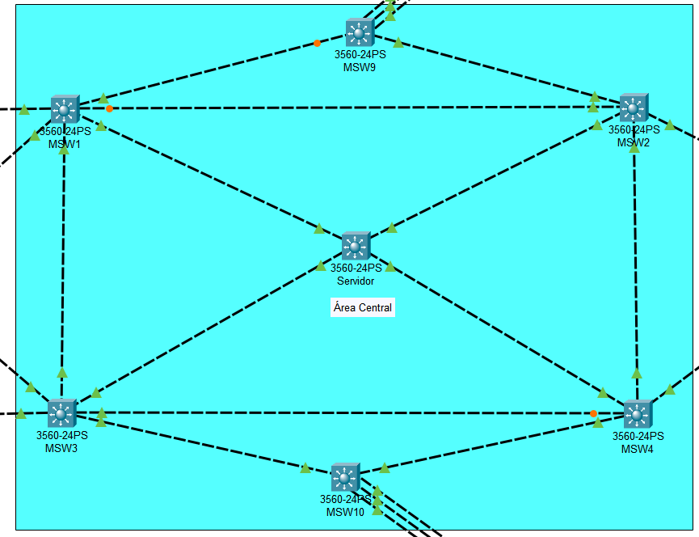
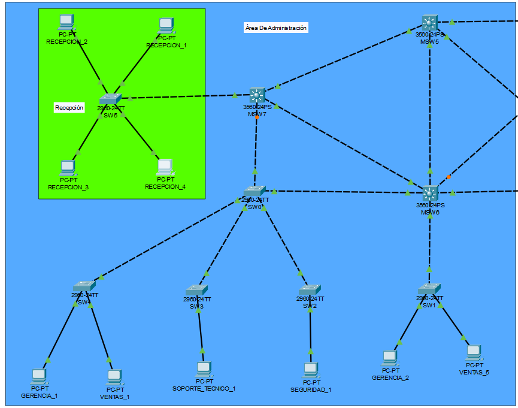
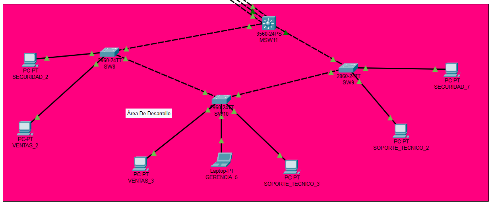
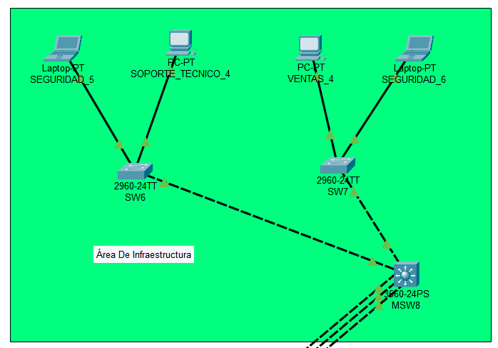
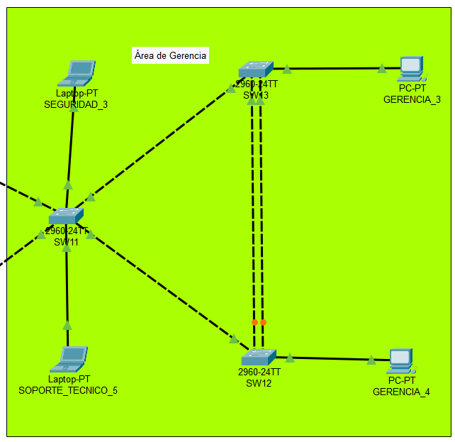
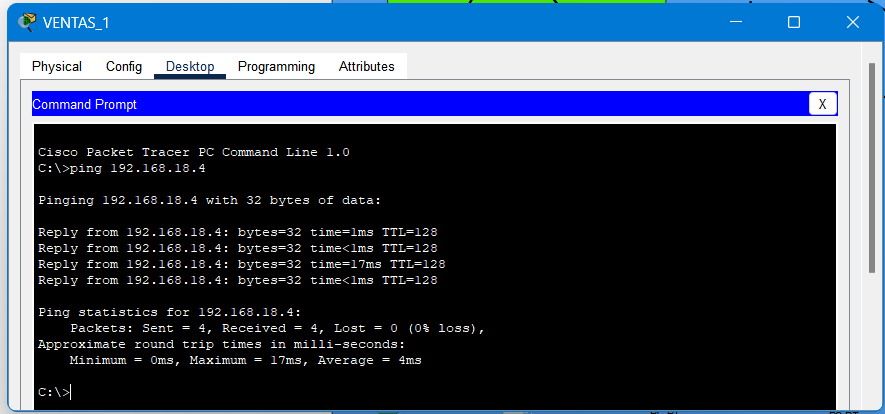
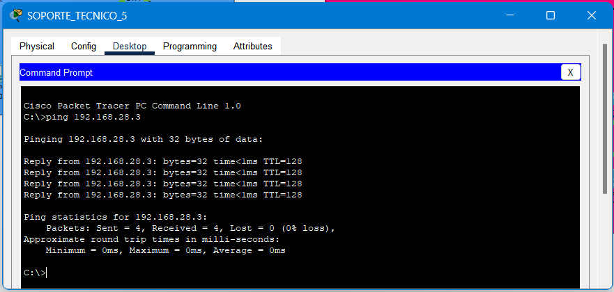
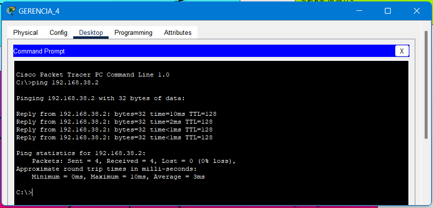
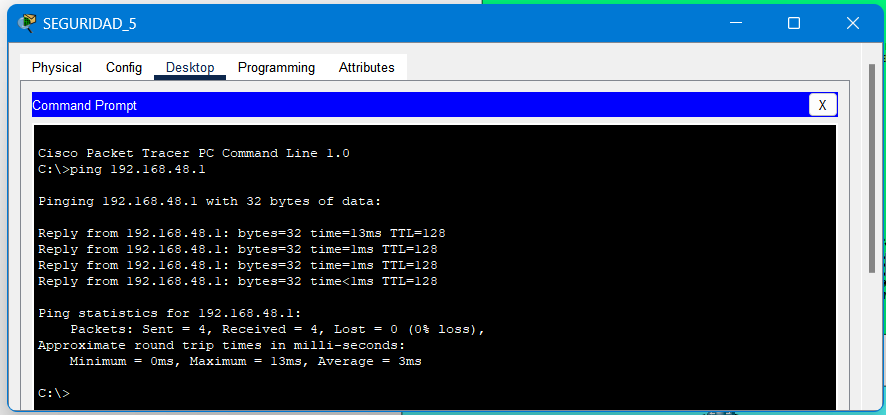
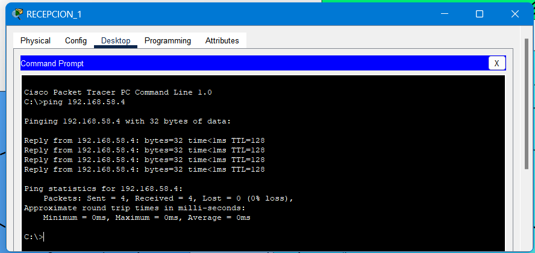

# Manual Técnico - Proyecto 1 

## Integrantes:
- **Josseline Griselda Montecinos Hernandez**  
  - **CUI:** 3010008160101  
  - **Carnet:** 202201534 
- **Carlos Manuel Lima y Lima**  
  - **CUI:** 3009368850101  
  - **Carnet:** 202201524  

---

# 1. Resumen de Direcciones IP  
En esta sección se presenta la asignación de direcciones IP para los diferentes departamentos de la empresa **Tech Solutions S.A.**.  
Cada departamento está segmentado mediante **VLANs**, lo que permite una mejor administración y seguridad de la red.  

## Departamentos y VLANs  

| Departamento | VLAN | Rango de Red |
|-------------|------|-------------|
| Ventas      | 18   | 192.168.18.0/24 |
| Soporte     | 28   | 192.168.28.0/24 |
| Gerencia    | 38   | 192.168.38.0/24 |
| Seguridad   | 48   | 192.168.48.0/24 |

## Área de Administración  
Esta área agrupa los dispositivos de los departamentos clave para la gestión de la empresa. Se han asignado VLANs específicas para segmentar cada equipo según su función.  

| NO | Nombre del Equipo        | IP              | VLAN |
|----|--------------------------|----------------|------|
| 1  | GERENCIA_1               | 192.168.38.1   | 38   |
| 2  | VENTAS_1                 | 192.168.18.1   | 18   |
| 3  | SOPORTE_TECNICO_1        | 192.168.28.1   | 28   |
| 4  | SEGURIDAD_1              | 192.168.48.1   | 48   |
| 5  | GERENCIA_2               | 192.168.38.2   | 38   |
| 6  | VENTAS_5                 | 192.168.18.5   | 18   |

### Área de Recepción  
La recepción tiene una VLAN independiente para gestionar sus dispositivos de manera eficiente.  

| Departamento | VLAN | Rango de Red |
|-------------|------|-------------|
| Recepción   | 58   | 192.168.58.0/24 |

| NO | Nombre del Equipo | IP              |
|----|------------------|----------------|
| 1  | RECEPCION_1      | 192.168.58.1   |
| 2  | RECEPCION_2      | 192.168.58.2   |
| 3  | RECEPCION_3      | 192.168.58.3   |
| 4  | RECEPCION_4      | 192.168.58.4   |

## Área de Desarrollo  
El área de desarrollo incluye equipos de varios departamentos, segmentados con VLANs específicas para cada función.  

| NO | Nombre del Equipo        | IP              | VLAN |
|----|--------------------------|----------------|------|
| 1  | SEGURIDAD_2              | 192.168.48.2   | 48   |
| 2  | VENTAS_2                 | 192.168.18.2   | 18   |
| 3  | VENTAS_3                 | 192.168.18.3   | 18   |
| 4  | GERENCIA_5               | 192.168.38.5   | 38   |
| 5  | SOPORTE_TECNICO_3        | 192.168.28.3   | 28   |
| 6  | SOPORTE_TECNICO_2        | 192.168.28.2   | 28   |
| 7  | SEGURIDAD_7              | 192.168.48.7   | 48   |

## Área de Infraestructura  
Esta área gestiona los dispositivos encargados del mantenimiento y soporte de la red.  

| NO | Nombre del Equipo        | IP              | VLAN |
|----|--------------------------|----------------|------|
| 1  | SEGURIDAD_5              | 192.168.48.5   | 48   |
| 2  | SOPORTE_TECNICO_4        | 192.168.28.4   | 28   |
| 3  | VENTAS_4                 | 192.168.18.4   | 18   |
| 4  | SEGURIDAD_6              | 192.168.48.6   | 48   |

## Área de Gerencia  
El área de gerencia cuenta con equipos críticos para la toma de decisiones dentro de la empresa.  

| NO | Nombre del Equipo        | IP              | VLAN |
|----|--------------------------|----------------|------|
| 1  | SEGURIDAD_3              | 192.168.48.3   | 48   |
| 2  | SOPORTE_TECNICO_5        | 192.168.28.5   | 28   |
| 3  | GERENCIA_3               | 192.168.38.3   | 38   |
| 4  | GERENCIA_4               | 192.168.38.4   | 38   |

---

# 2. Implementación De Las Topologías

En esta sección se presentan las capturas de pantalla de la implementación de la red en **Packet Tracer**, mostrando la configuración y distribución de las VLANs, enlaces troncales, redundancia y segmentación de la red.  

## Área Central (Backbone)  
El **backbone** es el núcleo de la red y conecta todas las áreas mediante enlaces redundantes y troncales.  
Aquí se configuran los protocolos **VTP, STP y EtherChannel**, asegurando una administración centralizada de VLANs y evitando bucles en la red.  

**Elementos principales:**
- Switches de distribución y core conectados con enlaces **EtherChannel** para mejorar la redundancia y el balanceo de carga.
- Configuración de **VTP** para la propagación de VLANs.
- Implementación de **Spanning Tree Protocol (STP)** para evitar bucles de red.

**Captura:**



## Área de Administración  
El área de administración contiene los dispositivos esenciales para la gestión de la empresa, incluyendo computadoras de gerencia y ventas.  

**Configuraciones clave:**
- Asignación de VLANs específicas para cada departamento.
- Configuración de puertos de acceso y troncales según la estructura de la red.

**Captura:**



## Área de Desarrollo  
El área de desarrollo incluye los equipos utilizados por los departamentos de soporte técnico, ventas y seguridad.  

**Configuraciones clave:**
- Segmentación de red mediante VLANs.
- Configuración de enlaces entre switches y dispositivos finales.


**Captura:**



## Área de Infraestructura  
El área de infraestructura maneja los dispositivos críticos para la operación de la red, como servidores y equipos de soporte técnico.  

**Configuraciones clave:**
- VLANs específicas para la gestión de servidores y equipos técnicos.
- Configuración de rutas para permitir la comunicación entre segmentos de red.


**Captura:**



## Área de Gerencia  
El área de gerencia agrupa los dispositivos administrativos de alto nivel y se encuentra conectada directamente al **backbone**.  

**Configuraciones clave:**
- Implementación de VLANs exclusivas para la gerencia.
- Configuración de enlaces redundantes para garantizar conectividad.

**Captura:**


--

# 3. Detalle de los Comandos Usados

Esta sección describe los comandos utilizados en la configuración de la red en **Packet Tracer**.  
Se implementaron **VLANs, VTP, STP y enlaces troncales** para segmentar la red, facilitar la administración y mejorar la redundancia.  

## 3.1 Configuración del Área Central (Backbone)  

El área central funciona como el **núcleo de la red**, donde se administra la segmentación lógica mediante **VTP** y se garantiza la conectividad entre las distintas áreas.  

### Configuración del VTP Server  
El **servidor VTP** es responsable de crear y distribuir la configuración de VLANs a los switches clientes.  

```bash
vtp version 2
vtp domain G3_technet
vtp password secure2025
vtp mode server
```
- **vtp version 2** → Establece la versión de VTP.  
- **vtp domain G3_technet** → Define el dominio VTP para la propagación de VLANs.  
- **vtp password secure2025** → Protege la configuración con una contraseña.  
- **vtp mode server** → Permite la administración centralizada de VLANs.  

#### Creación de VLANs  
Se crean y nombran las VLANs correspondientes a los departamentos de la empresa.  

```bash
vlan 18
name Ventas
vlan 28
name Soporte
vlan 38
name Gerencia
vlan 48
name Seguridad
exit
```

### Configuración del VTP Client  
Los switches en **modo cliente** reciben la configuración de VLANs del servidor VTP.  

```bash
vtp version 2
vtp domain G3_technet
vtp password secure2025
vtp mode client
```
- **vtp mode client** → Permite recibir información de VLANs sin posibilidad de modificarla.  

## 3.2 Configuración del Área de Administración  

Esta área alberga los dispositivos administrativos y de gestión de la empresa.  

### Configuración del VTP Client  
```bash
conf t
vtp version 2
vtp domain G3_technet
vtp password secure2025
vtp mode client
```

### Configuración del VTP Transparent  
Los switches en **modo transparente** no participan en VTP pero permiten el paso de la información.  

```bash
conf t
vtp version 2
vtp domain G3_technet
vtp password secure2025
vtp mode transparent
```
- **vtp mode transparent** → Permite la existencia de VLANs locales sin que sean eliminadas por el servidor VTP.  

### Configuración de VLAN para Recepción  
Se agrega una VLAN exclusiva para la recepción.  

```bash
conf t
vlan 58
name Recepcion
```

## 3.3 Configuración del Área de Desarrollo  

Aquí se configuran los switches de los desarrolladores, permitiendo la segmentación de su tráfico.  

### Configuración del VTP Client  
```bash
conf t
vtp version 2
vtp domain G3_technet
vtp password secure2025
vtp mode client
```

## 3.4 Configuración del Área de Infraestructura  

Los switches de esta área también reciben la configuración de VLANs.  

### Configuración del VTP Client  
```bash
conf t
vtp version 2
vtp domain G3_technet
vtp password secure2025
vtp mode client
```

## 3.5 Configuración del Área de Gerencia  

Los switches del área de gerencia permiten la conectividad segura para los directivos.  

### Configuración del VTP Client  
```bash
conf t
vtp version 2
vtp domain G3_technet
vtp password secure2025
vtp mode client
```


## 3.6 Configuración de Puertos de Acceso para VLANs  

Cada **puerto de acceso** permite la conexión de dispositivos finales a una VLAN específica.  

### VLAN 18 (Ventas)  
```bash
conf t
interface f0/
switchport mode access
switchport access vlan 18
```

### VLAN 28 (Soporte)  
```bash
conf t
interface f0/
switchport mode access
switchport access vlan 28
```

### VLAN 38 (Gerencia)  
```bash
conf t
interface f0/
switchport mode access
switchport access vlan 38
```

### VLAN 48 (Seguridad)  
```bash
conf t
interface f0/
switchport mode access
switchport access vlan 48
```
- **switchport mode access** → Configura el puerto para una sola VLAN.  
- **switchport access vlan X** → Asigna el puerto a la VLAN especificada.  


## 3.7 Configuración de Enlaces Troncales  

Los **enlaces troncales** permiten la comunicación entre switches y el transporte de múltiples VLANs.  

### Trunk en Switches de Capa 3  
```bash
interface range f0/
switchport trunk encapsulation dot1q
switchport mode trunk
switchport trunk allowed vlan 18,28,38,48
```
- **dot1q** → Protocolo estándar para la encapsulación de VLANs en enlaces troncales.  

### Trunk en Switches de Capa 2  
```bash
conf t
interface f0/
switchport mode trunk
switchport trunk allowed vlan 18,28,38,48
```
- **switchport trunk allowed vlan X,X,X** → Permite únicamente el tráfico de las VLANs indicadas.  


## 3.8 Configuración del Protocolo STP (Spanning Tree Protocol)  

El protocolo **STP** previene bucles y mejora la estabilidad de la red.  

```bash
conf t
spanning-tree mode rapid-pvst
spanning-tree vlan 18 root primary
spanning-tree vlan 28 root primary
spanning-tree vlan 38 root primary
spanning-tree vlan 48 root primary
```
- **rapid-pvst** → Variante de STP más rápida y eficiente.  
- **root primary** → Define al switch como la raíz de la topología de STP para cada VLAN.  

## **3.9 Configuración de EtherChannel**  

EtherChannel permite la **agregación de enlaces físicos** en un solo enlace lógico para aumentar el **rendimiento y la redundancia**.

### **3.9.1 Configuración de EtherChannel con LACP**  

LACP permite que los switches **negocien dinámicamente** la creación del canal.  

#### **Configuración en Switch 1**  
```bash
conf t
interface range fa0/#
channel-group 1 mode active

interface port-channel 1
switchport trunk encapsulation dot1q
switchport mode trunk
switchport trunk allowed vlan all
```
- **channel-group 1 mode active** → Activa LACP en este switch.  

#### **Configuración en Switch 2**  
```bash
conf t
interface range fa0/#
channel-group 1 mode passive

interface port-channel 1
switchport trunk encapsulation dot1q
switchport mode trunk
switchport trunk allowed vlan all
```
- **channel-group 1 mode passive** → Permite la activación del canal solo si el otro extremo lo inicia.  


### **3.9.2 Configuración de EtherChannel con PAgP**  

PAgP es un protocolo propietario de Cisco que también permite la agregación de enlaces.  

#### **Configuración en Switch 1**  
```bash
conf t
interface range fa0/#
channel-group 3 mode desirable

interface port-channel 3
switchport trunk encapsulation dot1q
switchport mode trunk
switchport trunk allowed vlan all
```
- **channel-group 3 mode desirable** → Activa PAgP y solicita activación al otro extremo.  

#### **Configuración en Switch 2**  
```bash
conf t
interface range fa0/#
channel-group 3 mode auto

interface port-channel 3
switchport trunk encapsulation dot1q
switchport mode trunk
switchport trunk allowed vlan all
```
- **channel-group 3 mode auto** → Espera la activación del canal desde el otro switch.  

---

## 4. Prueba de Conectividad: Ping entre Hosts en la Misma VLAN

Para verificar la correcta segmentación de la red y la configuración de las VLANs, se realizaron pruebas de conectividad entre dispositivos dentro de la misma VLAN utilizando el comando **ping**.

### 4.1 Capturas de Pantalla
A continuación, se presentan capturas de pantalla de las pruebas de **ping** realizadas en diferentes VLANs:

**Captura 1:** Prueba de **ping** entre dos dispositivos en VLAN 18 (Ventas).  


**Captura 2:** Prueba de **ping** entre dos dispositivos en VLAN 28 (Soporte).  


**Captura 3:** Prueba de **ping** entre dos dispositivos en VLAN 38 (Gerencia).  


**Captura 4:** Prueba de **ping** entre dos dispositivos en VLAN 48 (Seguridad).  


**Captura 5:** Prueba de **ping** entre dos dispositivos en VLAN 58 (Repeción).  

